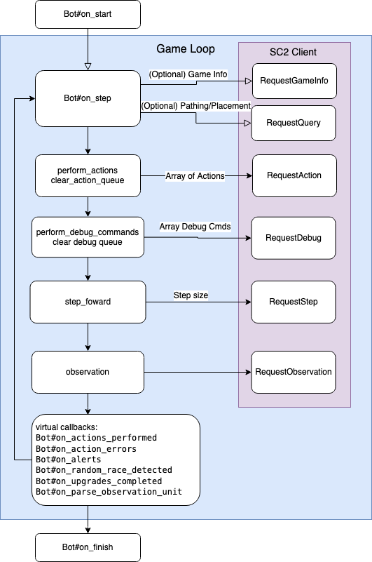

# Quick Reference

**Bookmark this page and come back to it - it's your cheatsheet.**  

If you are reading the tutorial for the first time, scroll over basic info below and spend a minute if anything catches your eye.  

You will feel overwhelmed if you read this all in one go, so lets rather start with small examples.  
After a quick scroll-over, {file:docs/TUTORIAL_01.md let's do some tutorials ➡️}. 

## Overview

Even though it's a reference, this document  _can_ be read top to bottom:  
- Glossing over constants and common game info, we then look in detail at  
- Unit/Group selection, actions, info and events.  
- Zooming out, we then review the match lifecycle, callbacks, api observations and communication.  
- We round off with map awareness and geometry, followed by static and meta-data.    

Unless stated otherwise, in the tables below, methods are from the context of an instance of a Bot. Meaning `on_step` you can call `common.minerals`.

## Constants

There are five types of data identifiers.  

- **Unit Types**: zergling, marine, zealot, gateway, warpgate, barracks, flying barracks, etc.
- **Abilities**: attack, stop, build, morph, lift, land, casting specials, etc.
- **Buffs** (incl. nerfs): cloaked, neural parasite, carrying minerals/gas, etc.
- **Effects**: scanner sweep, psi storm, corrosive bile, etc.
- **Upgrades**: tunneling claws, stimpack, ground weapons level 2, psi storm tech, etc. 

A few thousand constants are generated from the game's `stableids.json` for your auto-completion convenience.

| class             | examples                                                                                                        |
|-------------------|-----------------------------------------------------------------------------------------------------------------|
| {Api::UnitTypeId} | Api::UnitTypeId::ZERGLING, Api::UnitTypeId::BARRACKS                                                            |
| {Api::AbilityId}  | Api::AbilityId::ATTACK, Api::AbilityId::MORPHZERGLINGTOBANELING_BANELING,  Api::AbilityId::BARRACKSTRAIN_MARINE |
| {Api::BuffId}     | Api::BuffId::FUNGALGROWTH, Api::BuffId::CARRYMINERALFIELDMINERALS                                               |
| {Api::EffectId}   | Api::EffectId::SCANNERSWEEP, Api::EffectId::PSISTORMPERSISTENT, Api::EffectId::GUARDIANSHIELDPERSISTENT         |
| {Api::UpgradeId}  | Api::UpgradeId::PROTOSSGROUNDWEAPONSLEVEL2, Api::EffectId::PSISTORMTECH                                         |


## Bot identity

| method     | desc                                                                                         | Fast/Med/Slow |
|------------|----------------------------------------------------------------------------------------------|---------------|
| name       | bot name                                                                                     | F             |
| race       | race selected. this is updated if set Random                                                 | F             |
| enemy      | Sc2::Player::Enemy                                                                           | F             |
| enemy.race | enemy race selected. if Random, set after first seen unit. callback: on_random_race_detected | F             |
| enemy.name | enemy name                                                                                   | F             |
| enemy.type | :Participant, :Computer                                                                      | F             |

## Common info

| method                   | desc                                                    | Fast/Med/Slow |
|--------------------------|---------------------------------------------------------|---------------|
| game_loop                | incrementing int. timekeeping. nr of frames since start | F             |
| common.minerals          | mineral count, ui top right                             | F             |
| common.vespene           | gas, ui top right                                       | F             |
| common.food_cap          | supply available, ui top-right                          | F             |
| common.food_used         | supply used, ui top-right                               | F             |
| common.food_army         | army supply, ui hover supply icon                       | F             |
| common.food_workers      | worker supply, ui hover supply icon                     | F             |
| common.idle_worker_count | idlers, ui bottom left icon                             | F             |
| common.army_count        | unit count (not supply value)                           | F             |
| common.warp_gate_count   | Protoss: nr of warp gates                               | F             |
| common.larva_count       | Zerg: nr of larva                                       | F             |
| common.player_id         | int identifier                                          | F             |


## Units / Group selection

**Terminology**

The Api refers to units and structures collectively as `Api::Unit`.  
We refer to units as "units" and structures as "structures" and collectively as capital Unit.

**Unit**  
`Api::Unit` is a protobuf Message object with methods added for ease.  
Each unit or structure is of type {Api::Unit}.    
It has attributes, such as `unit.health` and `unit.pos.x` / `unit.pos.y` to get it's position.  
**Unique Id:** Each Unit has an integer unique identifier called #tag; you will use `unit.tag` to identify units.

**UnitGroup**  
{Sc2::UnitGroup} is a construct of our own.  
Units are contained in a Hash/Array hybrid which can perform actions such as #attack, #build, #train etc.  
The 10 in-game "Control Groups" aren't useful at this scale; UnitGroup is a programmatic alternative.

`Sc2::UnitGroup#units` holds `Hash<unit.tag, unit>` 


### Basic Unit selection and collection

**Primer**  
`Bot#all_units` holds everything, allied/enemy, units or structures.  
`Bot#units` holds allied group of units only  
`Bot#structures` holds allied group of structures  
`UnitGroup` offers filters such as `#workers` which returns a new group, containing only workers.

All for now, the full reference table is below these basic examples.

```ruby
class MyBot < Sc2::Player::Bot
  def on_step

    # Random example worker from UnitGroup units.workers
    specific_worker = units.workers.random
    first_worker = units.workers.at(0) # = units.workers.first 
    
    # Get a unit tag (unique id)
    specific_worker.tag #=> Integer
    
    # Get all unit tags in a group
    units.workers.tags #=> Array<Integer> of all unit tags = unit_group.units.keys

    # Look up a specific unit in a UnitGroup by tag
    units.workers[specific_worker.tag] #=> returns specific_worker

    # New empty unit group
    unit_group = Sc2::UnitGroup.new()
    # or create from existing group or an Array<Api::Unit>
    unit_group = Sc2::UnitGroup.new(other_ug)
    unit_group = Sc2::UnitGroup.new(arr_units)
    
    # Add a unit / Remove a unit
    unit_group.add(unit)
    unit_group.remove(unit)
    
    # Add, subtract as you see fit, i.e. if you have some units assigned as a forward army
    home_army = units.army.subtract(forward_army)
    home_army = units.army - forward_army
    
    # Hash sub-/supersets sets can be useful (<, <=, =>, >)
    # i.e. subset: are we sure all our flying units are present in the forward army?
    forward_army > units.army.select_attribute(:Flying) #=> bool: true if all flying units present

  end
end
```

**Filters**  
Every filter returns a new UnitGroup (cached), so you can chain and re-use without additional performance cost.  

```ruby
# Filter with blocks
injured = units.army.filter { |unit| unit.health < 100.0 }

# Filter on type(s)
units.army.select_type(Api::UnitTypeId::BANELING)
units.army.select_type([Api::UnitTypeId::BANELINGBURROWED, Api::UnitTypeId::BANELING])

# Filter on attribute(s)
units.select_attribute(Api::Attribute::Structure) # rather use #structures
units.army.select_attribute([Api::Attribute::Mechanical, Api::Attribute::Armored])

# Filters allow #not, which makes the immediate next filter be the inverse
# Select structures which are not creep tumors and not spine crawlers
structures.not.creep_tumors.not.select_type(Api::UnitTypeId::SPINECRAWLER)
```
### Global data 

| method              | type of Api::Unit's in UnitGroup          | Fast/Med/Slow |
|---------------------|-------------------------------------------|---------------|
| all_units           | full, unfiltered list of units+structures | F             |
| effects             | effects such as psi storm, lurker spikes  | F             |
| neutral.minerals    | mineral patches                           | F             |
| neutral.geyser      | gas geysers                               | F             |
| neutral.watchtowers | Xel'Naga watchtowers                      | F             |
| neutral.debris      | destructible debris                       | F             |

### Your Units and Structures

| method                                   | type of Api::Unit's in UnitGroup                  | Fast/Med/Slow |
|------------------------------------------|---------------------------------------------------|---------------|
| structures                               | with attribute :Structure                         | F             |
| structures.hq                            | Command Centres, PF, Nexus, Hatch, Lair, Hive     | F             |
| structures.townhalls                     | Command Centres, PF, Nexus, Hatch, Lair, Hive     | F             |
| structures.bases                         | Command Centres, PF, Nexus, Hatch, Lair, Hive     | F             |
| structures.gas                           | gas structures (Refinery, Assimulator, Extractor) | F             |
| structures.creep_tumors                  | Zerg creep tumors (any)                           | F             |
| structures.creep_tumors_burrowed         | Zerg creep tumors burrowed underground            | F             |
| structures.pylons / structures.warpables | Protoss pylons                                    | F             |
| structures.warpgates                     | Protoss warp gates                                | F             |
| structures.not.creep_tumors              | all structures excluding creep tumors             | F             |
| units                                    | not attribute :Structure                          | F             |
| units.workers                            | SCV, Probe, Drone + Burrowed                      | F             |
| units.larva                              | Zerg larva                                        | F             |
| units.queens                             | Zerg queen                                        | F             |
| units.overlords                          | Zerg overlords                                    | F             |
| units.army                               | units without: workers, queens, overlords, larva  | F             |
| units.warpables                          | Protoss warp prism                                | F             |

### Enemy units
Same as Bot's `unit` and `structures` template, but prefixed with `enemy.`

| method                                         | type of Api::Unit's in UnitGroup                  | Fast/Med/Slow |
|------------------------------------------------|---------------------------------------------------|---------------|
| enemy.all_units                                | enemy only, all units+structures                  | F             |
| enemy.structures                               | with attribute :Structure                         | F             |
| enemy.structures.hq                            | Command Centres, PF, Nexus, Hatch, Lair, Hive     | F             |
| enemy.structures.townhalls                     | Command Centres, PF, Nexus, Hatch, Lair, Hive     | F             |
| enemy.structures.bases                         | Command Centres, PF, Nexus, Hatch, Lair, Hive     | F             |
| enemy.structures.gas                           | gas structures (Refinery, Assimulator, Extractor) | F             |
| enemy.structures.creep_tumors                  | Zerg creep tumors (any)                           | F             |
| enemy.structures.creep_tumors_burrowed         | Zerg creep tumors burrowed underground            | F             |
| enemy.structures.pylons / structures.warpables | Protoss pylons                                    | F             |
| enemy.structures.warpgates                     | Protoss warp gates                                | F             |
| enemy.units                                    | not attribute :Structure                          | F             |
| enemy.units.workers                            | SCV, Probe, Drone + Burrowed                      | F             |
| enemy.units.larva                              | Zerg larva                                        | F             |
| enemy.units.queens                             | Zerg queen                                        | F             |
| enemy.units.overlords                          | Zerg overlords                                    | F             |
| enemy.units.army                               | units without: workers, queens, overlords, larva  | F             |
| enemy.structures.not.creep_tumors              | all structures excluding creep tumors             | F             |
| enemy.units.warpables                          | Protoss warp prism                                | F             |

### Unit Group filters

Common methods you can use on `Sc2::UnitGroup` to filter properties.

| method                            | desc                                           | Fast/Med/Slow |
|-----------------------------------|------------------------------------------------|---------------|
| select_type                       | select on Api::UnitTypeId                      | F             |
| reject_type                       | rejects on Api::UnitTypeId                     | F             |
| select_attribute                  | select on Api::Attribute                       | F             |
| reject_attribute                  | rejects on Api::Attribute                      | F             |
| filter(&block)                    | true/false from block: ug.filter(&:is_flying?) | F             |
| nearest_to(pos:, amount:)         | nearest unit(s) to position                    | M             |
| select_in_circle(point:, radius:) | only units in circle                           | M             |
| not                               | inverses next filter                           | M             |


### Creating your own filters
`units.workers` is just a helper method executing the filter `UnitGroup#select_type`, as is `units.army`.  
You can add a filter to UnitGroup by re-opening the class and defining your own filter methods.

```ruby
# in my_unit_group_extensions.rb
module Sc2
  class UnitGroup
    
    # The efficient way to use this is sub-filter from `units.army`, because it loops less.
    # i.e. units.army.zealots, even though the method also exists for units.zealots and any other unit group
    def zealots
      select_type(Api::UnitTypeId::ZEALOT)
    end
    
    # units.army.roaches
    # enemy.units.army.roaches
    def roaches
      select_type([Api::UnitTypeId::ROACH, Api::UnitTypeId::ROACHBURROWED])
    end
    
  end
end


```

## Performing actions / giving orders

We refer to an order or command as an "Action". 

`Api::Action`s can be performed from both the context of Bot, Unit or UnitGroup.
Sending raw actions from Bot requires that you pass the source Unit(s). The advantage of performing actions on Units/UnitGroups is one less param and better reading code.

An action requires an `ability_id`, such as `Api::AbilityId::ATTACK`, `Api::AbilityId::SMART`, etc.
"SMART" is the equivalent of performing a right-click in-game.  
Sometimes an action requires a `target` which is a position `Api::Point2D` or a target `Api::Unit`.

Let's inspect Unit Group first and it's action helper methods.

### UnitGroup actions

| method                            | desc                                                                                                                                               | Fast/Med/Slow |
|-----------------------------------|----------------------------------------------------------------------------------------------------------------------------------------------------|---------------|
| action(ability_id:, target: )     | makes a group perform a raw ability, i.e. Api::AbilityId::TERRANBUILD_BARRACKS                                                                     | F             |
| build(unit_type_id:, target: ...) | units.workers.build(unit_type_id: Api::UnitTypeId::BARRACKS, ...) <br>provide the unit type and target, the ability id is calculated for you.      | F             |
| smart(target: ...)                | right-click on a point or a unit, i.e. attack a unit, go into a bunker, mine a mineral                                                             | F             |
| attack(target: ...)               | attacks a Unit or attack-moves to position. units.army.attack(...)                                                                                 | F             |
| warp(unit_type_id:, target: ...)  | Protoss: structures.warpgates.warp(unit_type_id: Api::UnitTypeId::STALKER, target: point_2d_target).<br> geo.warp_points is helpful. see example. | F             |
| repair(target: ...)               | terran: units.workers.repair(target: injured_unit_or_structure)                                                                                    | F             |

Here's an example using Protoss `warp` for five stalkers. We use the unit group `structures.warpgates` as the source for this action.

```ruby

def on_step
  enemy_main = geo.enemy_start_position

  if can_afford?(unit_type_id: Api::UnitTypeId::STALKER, quantity: 5)

    # Find the nearest energy source, typically a Pylon (Api::Unit)
    energy_source = structures.warpables.nearest_to(pos: enemy_main)

    # geo.warp_points finds an array of 2D coordinates inside the power field
    # it matches the size of the unit_type_id passed, so they don't overlap
    points = geo.warp_points(source: energy_source,
                         unit_type_id: Api::UnitTypeId::STALKER)

    # Pick the 5 facing the enemy base's position
    points = points.min_by(5) { |p| p.distance_to(enemy_main) }

    # For UnitGroup structures.warpgates, tell them all to warp in stalkers at provided point
    points.each do |point|
      structures.warpgates.warp(unit_type_id: Api::UnitTypeId::STALKER, target: point)
    end
    
  end
  
end

```

### Action queue / scheduling (Shift+Click)

All action methods have a `queue_command:` parameter (omitted here for brevity), which queues this action after the others.    
This is akin to a Shift+Click in-game.  
It always defaults to `false`, so when giving multiple instructions to one unit per frame, only the last action is executed.

When `queue_command:` is set to `true`, the action you are sending will not override the previous command, but perform after it in sequence.    
It's handy for set-and-forget actions like constructing a structure and then queuing the worker to go mine afterwards.

### Unit actions

The signatures match UnitGroup, with the exception of `warp` which is really meant for a group of warpgates.  

**attack_with**  
One addition is `#attack_with`. 
We generally contextualize from our own units, but stylistically you can perform inverse of UnitGroup#attack on an enemy unit.   
For instance, you spot a ghost launching a nuke and you need to attack it quick with any 3 army units nearby.  

```ruby
hit_squad = enemy_ghost_unit.nearest(units: units.army, amount: 3)
enemy_ghost_unit.attack_with(units: hit_squad)
# synonymous with:
hit_squad.attack(target: enemy_ghost_unit)
```


| method                            | desc                                                                                                                                            | Fast/Med/Slow |
|-----------------------------------|-------------------------------------------------------------------------------------------------------------------------------------------------|---------------|
| unit.action(ability_id:, target: )     | makes a group perform a raw ability, i.e. Api::AbilityId::TERRANBUILD_BARRACKS                                                                  | F             |
| unit.build(unit_type_id:, target: ...) | units.workers.build(unit_type_id: Api::UnitTypeId::BARRACKS, ...) <br>provide the unit type and location, the ability id is calculated for you. | F             |
| unit.smart(target: ...)                | right-click on a point or a unit, i.e. attack a unit, go into a bunker, mine a mineral                                                          | F             |
| unit.attack(target: ...)               | attacks a Unit or attack-moves to position. units.army.attack(...)                                                                              | F             |
| unit.attack_with(units: ...)           | attacks self with supplied units:. single_enemy.attack_with(units: units.army)                                                                  | F             |
| unit.repair(target: ...)               | terran: units.workers.repair(target: injured_unit_or_structure)                                                                                 | F             |


You are always welcome to perform requests, however raw, directly from Bot#api or use some of the built-in Bot Action helpers.  
See the [Api Requests](#label-Api+Requests) section for a breakdown of raw commands and [Bot Actions](#label-Bot+Actions) for convenience methods built on-top of them.  

## Unit Data

We want you to explore the [protobuf protocol definitions](https://github.com/Blizzard/s2client-proto/blob/c04df4adbe274858a4eb8417175ee32ad02fd609/s2clientprotocol/raw.proto#L99). It is the best reference for information which comes back from the Api.   

Below is an extract from the message `Unit` in a table.   
For each of these properties you can use dot notation to access the property, i.e. `unit.health`.

We also provide `unit.previous`, if you need to compare the current state vs the previous state, i.e.
```ruby
puts "taking shield damage!" if unit.shield < unit.previous.shield 
# ... side-note: rather implement callback on_unit_damaged(unit, amount)
```

| attribute                 | desc                                                                                | Fast/Med/Slow |
|---------------------------|-------------------------------------------------------------------------------------|---------------|
| unit.tag                  | unique id                                                                           | F             |
| unit.unit_type            | correspondes to Api::UnitTypeId::NAME                                               | F             |
| unit.owner                | player id                                                                           | F             |
| unit.pos                  | Point - 3d position with #x,#y,#z                                                   | F             |
| unit.facing               | facing direction in radians                                                         | F             |
| unit.radius               | radius of unit model                                                                | F             |
| unit.build_progress       | range [0.0, 1.0]                                                                    | F             |
| unit.cloak                | See CloakState                                                                      | F             |
| unit.buff_ids             | array of Api::BuffId::NAME                                                          | F             |
| unit.detect_range         | detection range                                                                     | F             |
| unit.radar_range          | sensor tower range                                                                  | F             |
| unit.is_selected          | unit selected in game                                                               | F             |
| unit.is_on_screen         | unit on screen in game                                                              | F             |
| unit.is_blip              | detected by sensor tower                                                            | F             |
| unit.is_powered           | protoss: has power                                                                  | F             |
| unit.is_active            | building is training/researching (i.e. animated)                                    | F             |
| unit.attack_upgrade_level | int 0,1,2,3                                                                         | F             |
| unit.armor_upgrade_level  | int 0,1,2,3                                                                         | F             |
| unit.shield_upgrade_level | int 0,1,2,3                                                                         | F             |
| unit.health               | float                                                                               | F             |
| unit.health_max           | float                                                                               | F             |
| unit.shield               | float                                                                               | F             |
| unit.shield_max           | float                                                                               | F             |
| unit.energy               | float                                                                               | F             |
| unit.energy_max           | float                                                                               | F             |
| unit.mineral_contents     | minerals                                                                            | F             |
| unit.vespene_contents     | geyser / gas building                                                               | F             |
| unit.is_flying            | above ground level                                                                  | F             |
| unit.is_burrowed          | under ground level                                                                  | F             |
| unit.is_hallucination     | unit is your own or detected as a hallucination                                     | F             |
| unit.orders               | your unit's orders (UnitOrder)                                                      | F             |
| unit.add_on_tag           | terran: the id of the add-on building                                               | F             |
| unit.passengers           | array of PassengerUnit. has PassengerUnit#tag                                       | F             |
| unit.cargo_space_taken    | bunkers, medivacs, warp prism, etc.                                                 | F             |
| unit.cargo_space_max      | bunkers, medivacs, warp prism, etc.                                                 | F             |
| unit.assigned_harvesters  | for use with base structure                                                         | F             |
| unit.ideal_harvesters     | for use with base/harvesting structure                                              | F             |
| unit.weapon_cooldown      |                                                                                     | F             |
| unit.engaged_target_tag   |                                                                                     | F             |
| unit.buff_duration_remain | how long a buff or unit is still around (eg mule, broodling, chronoboost)           | F             |
| unit.buff_duration_max    |                                                                                     | F             |
| unit.rally_targets        | array of RallyTarget. always has #point (Point), could be rallied to unit via #tag. | F             |


**But that's NOT all.**  
See [Static Unit Data](#label-Static+Unit+data) below for more fixed meta information about Unit Type, such as weapon damage, range, etc.

## Unit Events

This library generally offers two ways to access events which occurred, `@event_*` attributes or by overriding ano `on_*` callback.  
The callbacks sometimes provide more context than just a Unit list, i.e. `on_unit_damaged(unit, amount)` provides the amount of damage for you.  

All attributes below return a `Sc2::UnitGroup` containing `Api::Unit`'s involved in the event.   
This table provides events and callbacks available, with an example below.  

| attribute                  | callback                                          | desc                                                 | Fast/Med/Slow |
|----------------------------|---------------------------------------------------|:-----------------------------------------------------|---------------|
| event_units_created        | on_unit_created(unit)                             | units only. probe or marine trained                  | F             |
| event_structures_started   | on_structure_started(unit)                        | structure in physical progress. not completed.       | F             |
| event_structures_completed | on_structure_completed(unit)                      | structure completes                                  | F             |
| event_units_type_changed   | on_unit_type_changed(unit, previous_unit_type_id) | morphs. baneling morph, viking land, etc.            | F             |
| event_units_damaged        | on_unit_damaged(unit, amount)                     | hp or shields took damage, but unit is not destroyed | F             |
| event_units_destroyed      | on_unit_destroyed(dead_unit)                      | you heard the news that you're dead                  | F             |

### Example handling of dead units
From your Bot, you can read the UnitGroup `@event_units_destroyed` `on_step` for all Units which got destroyed in the last frame.  
Even though those Units are not present in this frame, their `Api::Unit` objects are available, should like like to know, i.e. where something died and of what type.  
For example, if an SCV died, you can read last frame's `Api::Unit#orders` (`dead_unit.orders`). If it wanted to build an expansion, you might want to retry or expand elsewhere.  

You can loop over units in `@event_units_destroyed` **or** receive a callback by overriding (implementing) `on_unit_destroyed`.  
The callbacks occur after the game has ticked forward, but before `on_step`.  
Typically the callbacks come in the form of **individual units**, where the `@event_*` properties contain the **whole list**.

Here's an example, which attempts to save nearby workers after an orbital command structure is destroyed by the enemy.  
```ruby
class MyBot < Sc2::Player::Bot
  
  # Define the callback in your bot
  def on_unit_destroyed(dead_unit)
    
    # Custom logic
    if dead_unit.unit_type == Api::UnitTypeId::ORBITALCOMMAND && dead_unit.alliance == :Self
      
      # Dead base. Make SCV's mine a nearby mineral at the nearest base
      endangered = units.workers.select_in_circle(point: dead_unit.pos, radius:8)
      new_base = structures.bases.nearest_to(pos: dead_unit.pos)
      
      # Go mine nearby using right-click aka "smart" action
      endangered.smart(target: neutral.minerals.nearest_to(pos: new_base))
    end
  end
  
  def on_step
    
    # Alternatively, read the events attribute
    @event_units_destroyed.select_type(Api::UnitTypeId::ORBITALCOMMAND).each do |dead_unit|
      next unless dead_unit.alliance == :Self
      
      # Dead base. Same logic as above...
    end
    
    # Or even case by type
    @event_units_destroyed.filter{ |u| u.alliance == :Self }.each do |dead_unit|
      case dead_unit.unit_type
      when *Sc2::UnitGroup::TYPE_BASES  # Covers all bases. CC/PF/Orbital
        
        # Dead base. Same logic as above...
      end
    end
    
  end
end
```

The approach you take is stylistic. That covers Unit events, but there are additional callbacks below, once we learn about the match lifecycle.

## Lifecycle

Typically handled by Match or the ladder runner, the bot will automatically connect to the host and create/join a server.
The first game state observation is made and bot is readied.


From here the lifecycle is as follows:  



As a bare minimum you merely need to implement `on_step`. Observation and stepping is handled internally.


## Callbacks

Having examined the Lifecycle, here's a list of the callbacks you can implement.  
You can override these in your bot for additional features.

| method                             | desc                                                                                         | Fast/Med/Slow |
|------------------------------------|----------------------------------------------------------------------------------------------|---------------|
| on_start                           | override to perform work before first on_step gets called                                    | -             |
| on_step                            | the main game loop. called after stepping + new state observation.                           | -             |
| on_parse_observation_unit(unit)    | called before step for each Unit after observation. use this to decorate Unit before on_step | -             |
| on_actions_performed(actions)      | called before step with actions you performed since last Observation                         | -             |
| on_action_errors(errors)           | called before step if errors are present (errors = equivalent to red text)                   | _             |
| on_alerts(alerts)                  | called before step with alerts. nuke launch, nydus, etc.                                     | _             |
| on_upgrades_completed(upgrade_ids) | called before step with completed upgrade ids.                                               | _             |
| on_random_race_detected(race)      | called before step when Random enemy race discovered first                                   | _             |
| on_finish(result)                  | game over. result of :Victory, :Defeat or :Tie                                               | -             |

These act just like the optional unit callbacks from [Unit Events](#label-Unit+Events) above. You define these methods in your bot for them to take effect.
```ruby
class MyBot < Sc2::Player::Bot
  
  def on_start
    # load sqlite or flat files from ./data/* or do map parsing preparations
    # check win-rate versus opponent and select your best build
    # etc.
  end
  
  def on_finish(result)
    # Make a note of which strategy you chose for this opponent
    # and whether `result` was a :Victory.
  end
  
end
```

## Observation of game state

While there are many niceties, realtime data can also be accessed in it's raw form.  
The bulk of which is in #observation, which we parse to fill #units and #structures, callbacks, etc.  
Game info (#game_info) is slightly less important, holds less info and is only called if needed.  

`Bot#debug_json_observation` gives you a json dump of the `#observation` in `./data/debug_observation.json` for casual review.  
This might be easier to nagivate than `#observation.inspect`, due to it's size.

Below are some game state and miscellaneous utility methods from {Sc2::Player::Bot}.

| method                                  | desc                                                                                                                                    | Fast/Med/Slow |
|-----------------------------------------|-----------------------------------------------------------------------------------------------------------------------------------------|---------------|
| game_loop                               | incrementing int. timekeeping. nr of frames since start                                                                                 | F             |
| observation                             | observation data as per Api::Observation from protobuf                                                                                  | F             |
| game_info                               | Api::GameInfo from protobuf. will make api request + cache if stale.                                                                    | M             |
| previous                                | all game state info for previous frame stored, i.e. previous.structures                                                                 | F             |
| chats_received                          | read chat messages                                                                                                                      | F             |
| result                                  | :Victory, :Defeat, :Tie. use #on_finish callback instead.                                                                               | F             |
| status                                  | :in_game, :launched, etc.                                                                                                               | F             |
| spent_minerals                          | virtually tracked mineral spend this step                                                                                               | F             |
| spent_supply                            | virtually tracked supply spend this step                                                                                                | F             |
| spent_vespene                           | virtually tracked vespene spend this step                                                                                               | F             |
| can_afford?(unit_type_id:, quantity: 1) | internal bookkeeping tracks every spent resource for build/train/morph. <br> checks affordability for a Unit type (mineral/gas/supply). | F             |
| debug_json_observation                  | saves observation to `./data/debug_observation.json`                                                                                    | M             |

## Observation Layers

Before we talk about making Api requests, we should mention that there are several ways to interact with the game.  
By default we use the Raw layer which is data communication only.  
The Api providers additional layers which can be turned on simultaneously, namely the Render Layer and the Feature Layer.

### Raw Layer (always on)
The default - all data is communicated via protobuf in what you can liken to a huge JSON dump of everything you need to know.  
If something has a visual queue, like "Cloaked" (hidden), the data tells us this.  
Similarly if there is a radar circle on the map, the api tells us this too.  
The minimap is provided in bit map format, which we parse into a Numo array for efficiency.  

### Render Layer (not used)
The Render layer provides a visual view of the game in low quality. You see what the human sees.    
Due to the data transfer cost, this layer is not used in competitive AI.  
It's good for hobbyists who want to see what the game sees in ML, but it's outshone by an even better ML layer, the Feature Layer.    

### Feature Layer (optional)

Advanced, and not necessary for most botters.  
The feature layer provides access to a virtual UI, such as the player sees on the HUD in-game.  
You can perform physical clicks on buttons. The center panel ("multi-panel") is available for you to review.

The Feature Layer is almost exclusively used to fill in one or two missing parts from the Raw Layer, like unloading individual units.  
While Raw's `Api::AbilityId::UNLOADALL` works just fine for most cases, you can have fine-grained control by focussing and "clicking" specific buttons.    

Enabling the feature layer comes at a few millisecond **performance cost** as it doubles the network throughput of RequestObservation.


To enable this layer, set @enable_feature_layer in your Bot's configure method, which is called post-init, but before the server is joined.
```ruby
class MyBot < Sc2::Player::Bot
  
  def configure
    @enable_feature_layer = true
  end
  
end
```

**Feature layer actions**

When enabled you can perform requests prefixed with:

- `Bot#action_spatial`\* (i.e. action_spatial_unit_selection_rect)
- `Bot#action_ui`\* (i.e. action_ui_cargo_panel_unload)
  
See {Sc2::Player::Actions}.

## Api Requests

Requests can be called on your api connection.  
**Any request will be Slow** as it takes a few milliseconds to talk to the client.  
You can perform these on `Bot#api`, i.e. `api.available_maps` will return an array of maps available.

For most methods, there are helper method alternatives at the Bot level. See [Bot Actions](#label-Bot+Actions) for convenience methods to these raw api requests below.  

If you are interested in sending raw commands, you should be familiar with the protobuf definitions and/or have the `.proto` files handy for reference.

| method                            | desc                                                                                                 | Fast/Med/Slow |
|-----------------------------------|------------------------------------------------------------------------------------------------------|---------------|
| api.ping                          | tests connection. returns client information                                                         | S             |
| api.available_maps                | returns directory of maps that can be played on                                                      | S             |
| api.create_game                   | send to host to initialize game                                                                      | S             |
| api.join_game                     | joins a game                                                                                         | S             |
| api.step(step_count = 1)          | ticks game loop forward by nr of steps                                                               | S             |
| api.restart_game                  | restarts. single player only                                                                         | S             |
| api.leave_game                    | disconnects from a multiplayer game                                                                  | S             |
| api.request_quick_save            | saves game to an in-memory bookmark                                                                  | S             |
| api.request_quick_load            | loads from quick save                                                                                | S             |
| api.quit                          | quits and closes client. does not work on ladder                                                     | S             |
| api.data                          | data about different gameplay elements. may be different for different games.                        | S             |
| api.game_info                     | static data about the current game and map                                                           | S             |
| api.observation                   | snapshot of the current game state                                                                   | S             |
| api.query                         | additional methods for inspecting game state. synchronous and must wait on response                  | S             |
| api.query_pathings                | pathing specific query helper                                                                        | S             |
| api.query_abilities               | queries one or more ability availability checks                                                      | S             |
| api.query_abilities_for_unit_tags | helper making ability queries using unit tags                                                        | S             |
| api.query_placements              | query if locations are placeable                                                                     | S             |
| api.action                        | executes an array of [Api::Action] for a participant. <br>rather use Bot#action* for batching.       | S             |
| api.debug                         | display debug information and execute debug actions. <br>rather use Bot#debug* methods for batching. | S             |
| api.save_replay                   | gets replay binary data                                                                              | S             |
| api.replay_info                   | query game information about a replay without watching                                               | S             |
| api.start_replay                  | for watching replays                                                                                 | S             |
| api.observer_action               | move camera / follow player actions supported.                                                       | S             |
| api.observer_action_camera_move   | observer only, camera move action helper                                                             | S             |


## Bot Actions

See {Sc2::Player::Actions}.

| method                                       | desc                                                                                                                    | Fast/Med/Slow |
|----------------------------------------------|-------------------------------------------------------------------------------------------------------------------------|---------------|
| queue_action                                 | helper for queueing bare-bone Api::Action (any type) for this step                                                      | S             |
| action                                       | Best way to queue an action. most other methods pass through here. does `Api::ActionRawUnitCommand`                     | S             |
| build                                        | abstracts action, detects correct ability from a passed unit type<br>build(unit_type_id: Api::UnitTypeId::BARRACKS, ... | S             |
| warp                                         | Protoss: structures.warpgates.warp(...) to warp in units                                                                | S             |
| action_raw_toggle_autocast                   | enable/disable auto-cast for units                                                                                      | S             |
| action_raw_camera_move                       | moves camera                                                                                                            | S             |
| action_raw_unit_command                      | helper for doing queue_action with an Api::ActionRawUnitCommand                                                         | S             |
| action_chat                                  | send a chat message via channel :Broadcast or :Team.                                                                    | S             |
| action_spatial_unit_command                  | Feature Layer: unit command                                                                                             | S             |
| action_spatial_camera_move                   | Feature Layer: move camera                                                                                              | S             |
| action_spatial_unit_selection_point          | Feature Layer: click on unit/minimap                                                                                    | S             |
| action_spatial_unit_selection_rect           | Feature Layer: box units                                                                                                | S             |
| action_ui_control_group                      | Feature Layer: set/select control groups                                                                                | S             |
| action_ui_select_army                        | Feature Layer: select army hotkey                                                                                       | S             |
| action_ui_select_warp_gates                  | Feature Layer: select warp gate hotkey                                                                                  | S             |
| action_ui_select_larva                       | Feature Layer: select larva gate hotkey                                                                                 | S             |
| action_ui_select_idle_worker                 | Feature Layer: select idle workers gate hotkey                                                                          | S             |
| action_ui_multi_panel                        | Feature Layer: control the center bottom panel                                                                          | S             |
| action_ui_cargo_panel_unload                 | Feature Layer: control cargo displays in multi panel                                                                    | S             |
| action_ui_production_panel_remove_from_queue | Feature Layer: remove unit from production in multi panel                                                               | S             |
| action_ui_toggle_autocast                    | Feature Layer: enable/disable auto-cast for units                                                                       | S             |

Given these, will have no reason to perform raw Api commands.

## Debug Actions

For local, offline play only, you can use the debug methods to draw shapes and modify world behaviour such as instant-build and spawing/killing units.      
Debug commands are useful for setting up specific test scenarios.    
These commands are stripped at network layer on the competitive aiarena ladder.

| method                                                      | desc                                                                                                                               | Fast/Med/Slow |
|-------------------------------------------------------------|------------------------------------------------------------------------------------------------------------------------------------|---------------|
| debug_create_unit(unit_type_id:, owner:, pos:, quantity: 1) | Spawns a quantity of units under an owner at position given.                                                                       | S             |
| debug_draw_box(point:, radius: 0.5, color: nil)             | Draws a box around position xy at base of z.                                                                                       | S             |
| debug_draw_line(p0:, p1:, color: nil)                       | Draws a line between two Api::Point’s for color.                                                                                   | S             |
| debug_draw_sphere(point:, radius: 1.0, color: nil)          | Debug draws a sphere at position with a radius in color.                                                                           | S             |
| debug_end_game(end_result:)                                 | Ends game with a specified result of either Surrender or DeclareVictory.                                                           | S             |
| debug_game_state(command)                                   | Toggles cheat commands on/off (send only once to enable) See: Api::DebugGameState for values, i.e. Api::DebugGameState::Fast_build | S             |
| debug_kill_unit(unit_tags:)                                 | Kills a target unit or unit tag.                                                                                                   | S             |
| debug_print(text, size: 14)                                 | Prints debug text top left corner.                                                                                                 | S             |
| debug_set_unit_value(unit_tag:, unit_value:, value:)        | Sets unit_value Energy, Life or Shields for a specific unit tag to given value.                                                    | S             |
| queue_debug_command(debug_command)                          | Queues debug command for performing later.                                                                                         | S             |

## Geometry / Map

### Point2D
Targeting on the API is often for a 2D location `Api::Point2D`.  
Our `Api:Unit` positions are 3d, in the form of `Api::Point` (via `unit.pos`), but there are several position types.

The library provides the uniform `Sc2::Position`, to ease geometric interoperability.
You can sum a 3D Point with a 2D Point2D and get a resulting Point2D, which ignores the z-axis.
Proto objects `Api::Point`, `Api::Point2D`,`Api::PointI`,`Api::Size2DI` are additionally type `Sc2::Position` which respond to #x and #y.  

An array of [x,y] coordinates can be turned into a `Api::Point2D` with Array#to_p2d.
Here are some frequent conversions you might do to get a target `Api::Point2D`.
```ruby
# Creating directly
Api::Point[x, y]  #=> <Api::Point2D: x: ..., y: ...>
Api::Point2D.new(x: some_x, y: some_y)   #=> <Api::Point2D: x: ..., y: ...>

# Convert array coordinate pair [x, y]
[1.0, 2.0].to_p2d #=> <Api::Point2D: x: 1.0, y: 2.0>

# Unit.pos (Api::Point) conversion
some_unit.pos.to_2d #=> <Api::Point2D: x: ..., y: ...>

```  

**target keyword**  
Additionally, most abstracted targets which require either a 2D position (`Api::Point2D`) or a unit's tag (`Integer`).   
The `target:` keyword param in methods lets you know it accepts either.   
To preserve syntactic flow without the need to type-cast as often, when you see "target", you can pass any reasonable type.  


### Maps

#### Coordinate system
Games generally use XY coordinates with the **origin bottom-left**, so `[0.0, 0.0]` is at the origin, bottom left.  

Maps have a maximum 255 width/height [0 to 254, 0 to 254].  
The maps are clamped to the dimensions it was created at and dont have to be square, i.e. a "2000AtmoshperesAIE" is 144 x 132 (width by height).  

The library returns maps in the form `Numo` arrays for speed and processing.
If you intend on using raw map info (instead of the helper methods below), we encourage you to learn about [Numo](https://github.com/ruby-numo/numo-narray) which is Ruby's NumPy equivalent.

The map data comes in the form two arrays, where the outermost holds rows and the inner holds columns.
If these were pure Ruby arrays, you'd call them like this `parsed_visiblity_grid[y][x]` ❌,   
but the Numo lookup is one method with two params `parsed_visiblity_grid[y, x]` ✅.  
The 10th column, second from the bottom is therefore `parsed_visiblity_grid[1, 9]`.

Through the library the **only time where X/Y is swapped** is when working with **raw map data**.


#### Raw map data

Has Y amount of rows corresponding to map height and X amount of columns corresponding with map width.

| method                     | desc                                                   | Fast/Med/Slow           |
|----------------------------|--------------------------------------------------------|-------------------------|
| geo.parsed_placement_grid  | boolean: map tiles marked placeable. static.           | F                       |
| geo.parsed_terrain_height  | float: z position (height) of tile. static.            | F                       |
| geo.parsed_pathing_grid    | boolean: pathable tiles. updates to reflect buildings. | S, then cached 2 frames |
| geo.parsed_visibility_grid | boolean: minimap visibility. int flag 0,1,2            | S, then cached 2 frames |
| geo.parsed_creep           | boolean: minimap Zerg's creep spread                   | F                       |
| geo.parsed_power_grid      | boolean: Protoss' powered tiles                        | F                       |


For a visual aid, you can print the entire parsed_pathing_grid to console as 0's and 1's.

```ruby
# We reverse here (Numo::NArray#flipud) before we print, otherwise the map is vertically flipped.
geo.parsed_pathing_grid.flipud.each_over_axis(0) do |row|
  puts row.to_a.join("")
end
```

Typically, you'd want to use the helper methods such as `map_visible?(x:, y:)` or `placeable?(x:, y:)`, see table below.

### Map, Minimap & Geometric helpers

`Bot#geo` gives an instance of `Sc2::Player::Geometry`.  
From the context of your bot, you can access the following map/geo methods:

| method                                                                             | desc                                                                                                                                               | Fast/Med/Slow |
|------------------------------------------------------------------------------------|----------------------------------------------------------------------------------------------------------------------------------------------------|---------------|
| geo.map_width                                                                      | map tile width. Range is 1-255                                                                                                                     | F             |
| geo.map_height                                                                     | map tile height. Range is 1-255                                                                                                                    | F             |
| geo.map_tile_range_x                                                               | range 0..(map_width - 1). useful for x.clamp() to stay in map bounds                                                                               | F             |
| geo.map_tile_range_y                                                               | range 0..(map_height - 1). useful for y.clamp() to stay in map bounds                                                                              | F             |
| geo.powered?(x:, y:)                                                               | whether a x/y block is powered                                                                                                                     | F             |
| geo.pathable?(x:, y:)                                                              | whether a x/y block is pathable as per minimap                                                                                                     | F             |
| geo.terrain_height(x:, y:)                                                         | float height (z position) of tile (-16.0 to 16.0)                                                                                                  | F             |
| geo.visibility(x:, y:)                                                             | visibility indicator: 0=Hidden,1= Snapshot,2=Visible                                                                                               | F             |
| geo.map_visible?(x:, y:)                                                           | whether the point (tile) is currently in vision                                                                                                    | F             |
| geo.map_seen?(x:, y:)                                                              | whether point (tile) has been seen before or currently visible                                                                                     | F             |
| geo.map_unseen?(x:, y:)                                                            | has never been seen/explored before (dark fog)                                                                                                     | F             |
| geo.creep?(x:, y:)                                                                 | Zerg: whether a tile has creep on it, as per minimap                                                                                               | F             |
| geo.expansions                                                                     | Gets expos and surrounding minerals. <br>  `[Hash<Api::Point2D, UnitGroup>]` Location => UnitGroup of resources (minerals+geysers)                 | M             |
| geo.expansion_points                                                               | Returns a list of 2D points for expansion build locations<br> = geo.expansions.keys                                                                | M             |
| geo.expansions_unoccupied                                                          | a slice of #expansions where a base hasn't been built yet                                                                                          | M             |
| geo.build_coordinates(length:, on_creep: false, in_power: false)                   | buildable point grid for squares of size, i.e. 3 = 3x3 placements                                                                                  | M             |
| geo.build_placement_near(length:, target:, random: 1)                              | gets a buildable location for a square of length, near target. <br/>can randomly select between `random` number of possible points for robustness. | M             |
| geo.points_nearest_linear(source:, target:, offset: 0.0, increment: 1.0, count: 1) | find points on a straight line. equally spaced from a source to a target. line units in a row.                                                     | F             |
| geo.point_random_near(pos:, offset: 1.0)                                           | a random point near a location with a positive/negative offset magnitude. scatter units.                                                           | F             |
| geo.point_random_on_circle(pos:, radius: 1.0)                                      | a random point on a circle's circumference. fan units around point.                                                                                | F             |
| geo.warp_points(source:, unit_type_id: )                                           | Protoss: warp locations at a power source, for the width of a unit type.                                                                           | M             |

### Position (Point and Vector math)

When you get into "micro", the micro-management of unit actions for performance or strategic gain, these basic geometric helpers will get you started.

As mentioned above, `Api::Unit#pos` returns a 3d `Api::Point` which conforms to `Sc2::Position`.  
When targeting or working with coordinates, you generally work with `Api::Point2D`, which also conforms to `Sc2::Position`.  
You thereby interoperate between the various coordinate types using common ground and without too type conversion.

Let's review what you can do with `unit.pos` using these `Sc2::Position` methods.

| method                                     | desc                                                                                                                        | Fast/Med/Slow |
|--------------------------------------------|-----------------------------------------------------------------------------------------------------------------------------|---------------|
| add(other) ⇒ Api::Point2D (also: #+)       | a new point representing the sum of this point and the other point<br>pos.add(other_pos) or: pos + other_pos                | F             |
| subtract(other) ⇒ Api::Point2D (also: #-)  | returns a new point representing the difference between this point and the other point/number.                              | F             |
| divide(scalar) ⇒ Api::Point2D (also: #/)   | a new point representing this point divided by the scalar.                                                                  | F             |
| multiply(scalar) ⇒ Api::Point2D (also: #*) | returns this point multiplied by the scalar                                                                                 | F             |
| cross_product(other) ⇒ Float               | the cross product of this vector and the other vector.                                                                      | F             |
| dot(other) ⇒ Float                         | the dot product of this vector and the other vector.                                                                        | F             |
| angle_to(other) ⇒ Float                    | the angle between this vector and the other vector, in radians.                                                             | F             |
| away_from(other, distance) ⇒ Point2D       | moves in direction away from the other point by distance.                                                                   | F             |
| distance_squared_to(other) ⇒ Float         | the squared distance between this point and the other point.                                                                | F             |
| distance_to(other) ⇒ Float                 | calculates the distance between self and other Sc2::Position                                                                | F             |
| distance_to_circle(center, radius) ⇒ Float | distance from this point to the circle. returns 0 if point is inside circle                                                 | F             |
| distance_to_coordinate(x:, y:) ⇒ Float     | distance between this point and coordinate of x and y                                                                       | F             |
| lerp(other, scale) ⇒ Api::Point2D          | linear interpolation between this point and another for scale Finds a point on a line between two points at % along the way | F             |
| magnitude ⇒ Float                          | for vector returns the magnitude, synonymous with Math.hypot                                                                | F             |
| normalize ⇒ Api::Point2D                   | a new point representing the normalized version of this vector (unit length)                                                | F             |
| offset(x, y) ⇒ Api::Point2D                | creates a new point with x and y which is offset                                                                            | F             |
| offset!(x, y) ⇒ Sc2::Position              | changes this point’s x and y by the supplied offset.                                                                        | F             |
| random_offset(offset) ⇒ Api::Point2D       | randomly adjusts both x and y by a range of: -offset..offset.                                                               | F             |
| random_offset!(offset) ⇒ Sc2::Position     | changes this point’s x and y by the supplied offset.                                                                        | F             |
| towards(other, distance) ⇒ Point2D         | moves in direction towards other point by distance.                                                                         | F             |

This is the most likely area which will gain expansion over time, so review the class {Sc2::Position} for updates.

## Static Data 

There is a large amount of structure game data available, which doesn't pertain to state but rather the built-in game attributes.  
What if you wanted to know the type of damage a Weapon does, a unit's vision range or how much an upgrade costs?

The `Bot#data` grants access to information via `Sc2::Data`.  

### Data
See {Sc2::Data} and the data protocol file at https://github.com/Blizzard/s2client-proto/blob/master/s2clientprotocol/data.proto.

| method                        | desc                                                        | Fast/Med/Slow |
|-------------------------------|-------------------------------------------------------------|---------------|
| data.abilities \[ability_id\] | Hash<Integer, Api::AbilityData> AbilityId => AbilityData    | F             |
| data.upgrades \[upgrade_id\]  | Hash<Integer, Api::UpgradeData> UpgradeId => UpgradeData    | F             |
| data.units  \[unit_type_id\]  | Hash<Integer, Api::UnitTypeData> UnitTypeId => UnitTypeData | F             |
| data.effects                  | just a list, use `Api::EffectId` directly                   | F             |
| data.buffs                    | just a list, use `Api::BuffId` directly                     | F             |


### Static Unit data

Data as it pertains to a specific unit's data type can be accessed via the convenience method `Api::Unit#unit_data`.   

```ruby

# Consider you select a marine
fighter = units.army.select_type(Api::UnitTypeId::MARINE).random

# Print info about unit type MARINE
pp fighter.unit_data 

# Or from the context of your Bot, pass in a marine to get info about type MARINE
pp unit_data(fighter)

# Or by using a UnitTypeId directly
pp unit_data(Api::UnitTypeId::MARINE)
```

These are all equal.

**Real-time data vs static**

The Data class brings data from the current game, once before `on_start`. It is **fixed** for the entire game.  
`some_unit.unit_data` (which calls `data.units`) will not change, nor will `data.abilities[...]`

All actual {Api::Unit} properties are **realtime, for this moment**, refreshed on each Observation.  
See the [protobuf message Unit](https://github.com/Blizzard/s2client-proto/blob/c04df4adbe274858a4eb8417175ee32ad02fd609/s2clientprotocol/raw.proto#L99) for a list of such properties or run #inspect on a Unit to observe it's attributes.  

### Static Ability data vs Query

As above with unit_data, `Bot#ability_data(ability_id)` can provide **static** information surrounding a specific ability.

**Can a unit use the ability?**  
Conversely, if you need **dynamic** information about which abilities the unit can perform right now, you can run a Query for that information.    
This will show, i.e. if a specific Ghost can Nuke or whether a Gateway can warp a Stalker, etc.
```ruby
query_abilities_for_unit_tags(some_unit.tag, ignore_resource_requirements: true)
```

### Tech tree 

Courtesy of the brilliant work of the python crew, Dentosal and BuRny <3.  
If you wish to do meta programming based on the game's tech requirement structure, you can use the tech {Api::TechTree}.  

All calls are statically made to the class.

| method                                                           | desc                                                                               | Fast/Med/Slow |
|------------------------------------------------------------------|------------------------------------------------------------------------------------|---------------|
| Api::TechTree.creates_unit_types(unit_type_id:)                  | what unit types a specific unit type can produce. Barracks->Marine/Marauder/Reaper | F             |
| Api::TechTree.unit_created_from(unit_type_id:)                   | returns the unit type which can create this unit. Marine->Barracks                 | F             |
| Api::TechTree.unit_type_creation_abilities(source:, target: nil) | which units can be created at source + the ability to trigger it.                  | F             |
| Api::TechTree.unit_type_creation_ability_id(source:, target:)    | which ability id creates the target, given the source unit/building                | F             |
| Api::TechTree.upgrade_researched_from(upgrade_id:)               | what the unit type an upgrade is researched from                                   | F             |


## Protocol

The library talks to SC2 over Google Protobuf.  
The .proto files ship with the gem but their original source is available here for review:  
Proto: https://github.com/Blizzard/s2client-proto/tree/master/s2clientprotocol  <br>
Overview: https://github.com/Blizzard/s2client-proto/blob/master/docs/protocol.md

## Namespaces

The code forces you to know at all times whether you're working with the library or api objects.    
`Sc2` namespace is for gem internals.  
`Api` namespace is for protocol data and Message objects.  

Functionality might be added to Api object, such as `Api::Unit#attack` for programming ease.  
```hero_marine.attack(target: ...)``` is a more desirable usage than working from the bot instead, i.e.
```ruby
class MyBot < Sc2::Player::Bot
  def on_step

    marines = units.army.select_type(Api::UnitTypeId::MARINE)
    hero_marine = marines.first
    
    # Example raw action command for unit from Bot
    api.send_request_for(action: Api::RequestAction.new(
      actions: [Api::Action.new(
        action_raw: Api::ActionRaw.new(
          unit_command: Api::ActionRawUnitCommand.new(
            ability_id: Api::AbilityId::ATTACK,
            source: hero_marine.tag,
            target_unit_tag: #...
          )
        )
      )]
    ))
    
    # Simplified with helper method action_raw_unit_command
    action_raw_unit_command(unit_tags: hero_marine.tag, 
                                ability_id: Api::AbilityId::ATTACK, 
                                target_unit_tag: #... 
    )
    
    # But from the context of a Unit, using #attack extension,
    # this code feels better than both.
    hero_marine.attack(target: ) #...
    
    # (unit groups, same syntax as Unit) 
    # marines.attack(target: #...)
  end
end
```

Therefore, sometimes `Api` objects such as `Api::Unit` or `Api::Point2D` will do `Sc2`-type work and be more than just store information or be a target for an action request.  
It will be to your own benefit to actually reference the class documentation. If you open up {Api::Unit}, this will be immediately apparent.

### Verbose by design
References are verbose by default and mimics the proto definition, which is good for your immersion.  
If you target something from the Api, you have to type "Api" and you _learn_ about the Api. Yay!

However, this means you often triple-bang into constants, i.e. `Api::AbilityId::RALLY_BUILDING`.  
Once you've mastered everything, feel free to **reduce verbosity** in any way you see fit.

```ruby
# Option A: Define short names. Safe.
TID = Api::UnitTypeId # i.e. TID:MOTHERSHIP
AID = Api::AbilityId # Api::AbilityId::EFFECT_STIM becomes AID:EFFECT_STIM

# etc. for EffectId, BuffId, UpgradeId

# Optionally: Namespace your bot inside module Sc2 to drop all Sc2::* prefixes. Safe.
module Sc2
  class MyBot < Player::Bot
    
    # Option B: Mildly riskier than Option A, but safe for now
    include Api # All of Api is yours, directly call UnitTypeId::MOTHERSHIP
    
  end
end
```

Protobuf enums can be referenced as Symbols.
```ruby
# enum Result {
#   Victory = 1;
#   Defeat = 2;
#   Tie = 3;
#   Undecided = 4;
# }
Api::Result::Victory # can be substituted as...
:Victory

# enum AIBuild {
#   RandomBuild = 1;
#   Rush = 2;
#   Timing = 3;
#   Power = 4;
#   Macro = 5;
#   Air = 6;
# }
Api::AIBuild::Air # can be substituted as ...
:Air

# This is not true for the Api::*Id::* fields, such as AbilityId, because they are generated and not proto definitions.
```

**Keyword arguments**  
Also, where an id for a specific type is required, keyword params will tell you what it wants. Great!  
`def ...(unit_type_id: ...)` `def ...(ability_id: ...)` and so on.

Descriptive keyword arguments are here to stay, but should you grow weary of the lengthy signatures, you are welcome to define your own wrapping methods for your most frequently typed calls.

New botters should learn easily, but you can create your own joy. ❤️

---  

Here be {file:docs/TUTORIAL_01.md tutorials}.