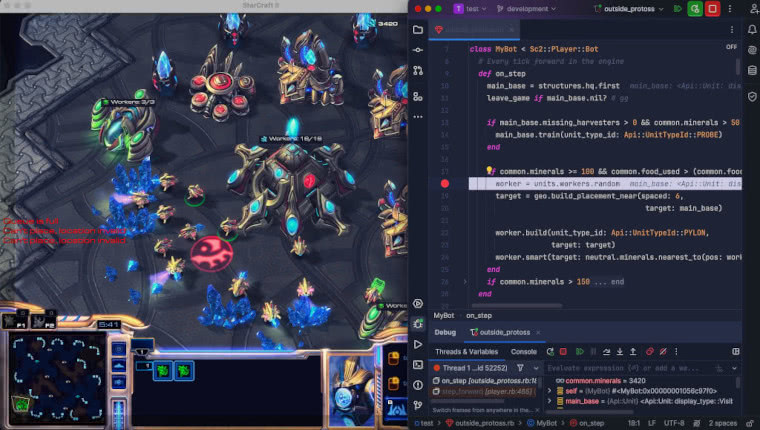

# SC2 AI

So, you wanted to be a pro gamer, but made a life-typo. All good, friendo.   
Let's put those weathered hands and whetted wits to work and play and slay some nerds, ok?  

This is a Ruby interface for StarCraft® II.  
The game is now available, free to play, at https://starcraft2.blizzard.com.  
This Ruby language is also now available, free to play, at https://www.ruby-lang.org.    

Mac (Apple® silicon / Intel®), Microsoft© Windows, WSL and Linux® are all supported. 

You should read this file and then {file:docs/QUICK_REFERENCE.md proceed to the tutorials}.

## I am Jack's digital fury
The things we write are called "bots". They beat crap out of each other on https://aiarena.net.  
There are [regular tournaments](https://www.youtube.com/@ProbotsAI) and a permanent live stream here https://www.twitch.tv/aiarenastream.

That's right, you just stumbled upon the final boss of competitive coding. Welcome to Fight Club for Nerds, nerd.  
This is the only door in[.🚪](https://discord.gg/Emm5Ztz)



## Installation
About 5 Steps. Not bad.

### Game + Maps
Download [StarCraft® II](https://starcraft2.blizzard.com) installer and use the default paths.

**Maps**  
After install, download the latest aiarena.net [ladder maps](https://aiarena.net/wiki/maps/#wiki-toc-how-to-install-maps) from the top.  
If they end with ".zip.upload", rename to ".zip".  

Extract them into your install folder + "Maps", i.e.  
Mac: `/Applications/StarCraft II/Maps/`  
Windows: `C:\Program Files (x86)\StarCraft II\Maps\\`  
(Create the folder if it isn't there.)  

Write down one of the map names, we'll use it in a bit when starting a match.

### System Requirements

Oddly, you don't need to know any math to start botting.    
The gem, however, needs some linear algebra for heavy lifting in the form of OpenBLAS and LAPACKE.

**MacOS**  
`brew install openblas`

**Debian/Ubuntu and WSL2**  
`apt install libblas3 liblapacke`

**Windows**  
From Command Prompt:  
`ridk enable & pacman -S mingw-w64-ucrt-x86_64-openblas --noconfirm`

[//]: # (That should be enough for everyone, but if `numo-linalg` complains,   )
[//]: # (then `bundle install --redownload` to rebuild dependencies anew.)

### Get the gem

#### Regarding Ruby versions
If you have any issues with profiling or debugging, Ruby 3.2 runs amazingly.  
Ruby 3.3 performs even better.  
Enabling YJIT is essential as we repeat methods frequently. Pass the runtime arg `--yjit` or `export RUBY_YJIT_ENABLE=1`.  

#### On to the gem
Until further notice, this gem is not on rubygems. It's a hidden gem.  

    $ bundle init 

and add this line to your Gemfile:
```ruby
gem 'sc2ai', git: 'https://github.com/dysonreturns/sc2ai'
```

**Windows-only**, you'll need patched gems too:
```ruby
gem "kdtree", git: "https://github.com/dysonreturns/kdtree.git", branch: "master"
gem "async-process", git: "https://github.com/dysonreturns/async-process.git", branch: "windows-pgroup-params"
gem 'sc2ai', git: 'https://github.com/dysonreturns/sc2ai'
```

And then execute:

    $ bundle install

We depend on [rumale](https://github.com/yoshoku/rumale) by happenstance, so if you're keen to play with machine learning in Ruby, you have the option.  
You will have more success (and fun), however, getting your hands dirty.

If you're **not** running Windows, WSL or full Linux, we are ready to launch. 
Skip to [Configure StarCraft® II](#label-Configure+StarCraft-C2-AE+II)


### Windows, WSL setup
For pure Windows, you should be fine using the Ruby installer, without additional config, but the SC2 process lifecycle is flakey.

For speed and enjoyment, we recommend installing WSL.
This library was tested under WSL2 (Ubuntu) as WSL1 is too old for anyone to be running it.  

**WSL**  
In this case, SC2 is installed on Windows and your code is executed on Linux.    
To allow the two systems two to talk to each other, open the firewall between them as follows from PowerShell as Admin:   
`New-NetFirewallRule -DisplayName "WSL" -Direction Inbound  -InterfaceAlias "vEthernet (WSL)"  -Action Allow`  
That should be it for most typical cases. You are ready to launch.

**One exception:** By default the two OS's have the same hostname. We can therefore detect the magic domain of Windows using: hostname + ".mshome.net".  
If you have WSL hostname which _doesn't_ match Windows, setup a custom config either via yaml config.  
Create "sc2ai.yaml" in your project root with your windows host defined.
```yaml
---
host: "WINDOWS-HOSTNAME.mshome.net"
```
... or adding a inline configuration before starting a Match
```ruby
Sc2.config do |config|
    config.host = "MY-WIN-HOSTNAME.mshome.net"
end
```

### Linux, Wine setup
Note: In this scenario is only if you installed SC2 itself on Linux.    
Meaning, the SC2 client you installed is either [headless](https://github.com/Blizzard/s2client-proto#downloads), via Lutris or Wine.

You can manually set your client PATH and the detected PlatForm with environment variables.  
`ENV['SC2PATH']` can be set manually to Starcraft 2 base directory for Linux, if using Lutris. This is the folder which contains the "Versions" folder.  
`ENV['SC2PF']` can and should be manually set to "WineLinux" when running Wine

Additional options which are useful for Linux can be set via {Sc2::Configuration}.

### Configure StarCraft® II

Our competitive ladder plays on v4.10, because there's a Linux client at v4.10 which allows us to play headless.  
The retail game version is way further ahead - currently at v5.0.12 as of this writing.  
  
No worries, all the latest game updates are backported directly into our AI Edition maps (thanks to one beautiful Zerg).
You're free to launch SC2 retail right now, as in the [Running a Match](#label-Running+a+Match) section, but you'll **notice you can't control units manually** or move the camera.

To match the competitive ladder and **gain control locally**, lets download and configure the match runner to launch 4.10 - easy.

#### Method 1 (recommended)
Automatic. From your project directory execute:   
`bundle exec sc2ai setup410`

This launches the client and connects with a special replay file which will handle the downloads.

#### Method 2 - Watch a replay 
Manually download any recent replay from aiarena.net and double click it to watch.  
SC2Switcher will download 4.10 for you.   
Pick any replay here: https://aiarena.net/results/  
Even if it says "Unable to open map", you're ready.

Create "sc2ai.yaml" in your project root with with the `version` set to "4.10"
```yaml
---
version: "4.10"
```
or configure on the fly:
```ruby
Sc2.config do |config|
    config.version = "4.10"
end
```
## Running a Match

The Hello World of botting is a worker rush.  
You're invited to create `hello_world.rb`, paste the code inside and execute it via   
`bundle exec ruby --yjit hello_world.rb `

For now, the milliseconds each step took is printed for your constant focus. More on this later.

The code:
```ruby
require "sc2ai"

class MyBot < Sc2::Player::Bot
  def on_step
    if game_loop == 0
      enemy_start_pos = game_info.start_raw.start_locations.first
      units.workers.attack(target: enemy_start_pos)
    end

    # If your attack fails, "good game" and exit
    if units.workers.size.zero?
      action_chat("gg", channel: Api::ActionChat::Channel::Broadcast)
      leave_game
    end
  end
end

Sc2::Match.new(
  players: [
    MyBot.new(name: "Rubocop", race: Api::Race::Terran),
    Sc2::Player::Computer.new(race: Api::Race::Protoss, difficulty: Api::Difficulty::VeryEasy)
  ],
  map: "GoldenauraAIE" # Or any of the downloaded map names
).run
```

Congrats, you're botting!
The replay is auto-saved as `data/replays/autosave-#{botname}.SC2Replay` for casual review.  

If the code scares you, especially that `game_info.start_raw.start_locations.first` part, fear not.   
The syntax is generally quite friendly while also forcibly teaching you the API.  
We have some extremely useful tutorials ahead once you're done skimming the next two sections.

## Competing on the ladder

The dear ladder Admin have had their holiday consumed by moving the aiarena infrastructure to AWS.     
Ruby support for the aiarena.net ladder will follow in 2024.  
Instructions will be provided when the time comes.

### Practice vs built-in AI
A good practice partner is the built-in AI at `Api::Difficulty` from recommended `Hard` through to `CheatInsane`.  
You can also choose an `ai_build` preset.  
```ruby 
Sc2::Player::Computer.new(difficulty: Api::Difficulty::Hard, ai_build: Api::AIBuild::Air)
```

### Play offline against another bot

To play against yourself or a friend, from the same computer, just setup a multi-bot match.  
Two instances of the game will load.  
```ruby
# require_relative "../friendo/some_other_bot.rb"
class SomeOtherBot < Sc2::Player::Bot
  def on_step; end
end

# Cheating is disabled at network layer on the ladder, but this should help locally:
# module Sc2; class Player; private def perform_debug_commands = clear_debug_command_queue; end; end;

Sc2::Match.new(
  players: [
    MyBot.new(name: "Rubocop", race: Api::Race::Terran),
    SomeOtherBot.new(name: "Jean-ClawsVD", race: Api::Race::Zerg) # :)
  ],
  map: "GoldenauraAIE",
  
).run

```
## Usage

You've done so excellent thus far, that we should reward you with ending this README. 

I bet you have so many questions about training units, building structures, research and abilities...    
Commanding your army units, making groups and knowing your enemy...  
Info about your resources, supply, reading the minimap, vision, creep and pathing...  
Or even how is ANY OF THIS possible?

Let's go through all of the above in byte sized chunks with the tutorials which follows.
The README is over, but check out [Acknowledgements](#label-Acknowledgements) below which answers one of these questions.

Onwards, {file:docs/QUICK_REFERENCE.md to the tutorials!}

## Development

After checking out the repo, run `bin/setup` to install dependencies.  
To install this gem onto your local machine, run `bundle exec rake install`.  

## Contributing

[Conventional commits](https://www.conventionalcommits.org/en/v1.0.0/) preferred, please.  
Fork and create a branch `feature-name-here`, `fixes-this-problem` and create a pull request.  
Bug reports and pull requests are welcome on GitHub at https://github.com/dysonreturns/sc2ai.  
This project is intended to be a safe, welcoming space for collaboration, and contributors are expected to adhere to the [code of conduct](https://github.com/dysonreturns/sc2ai/blob/main/docs/CODE_OF_CONDUCT.md).

## Acknowledgements

The good people at Blizzard Entertainment® and DeepMind Technologies Limited ("Google DeepMind") collaborated on SC2 AI an research project called AlphaStar.
By the good graces of Blizzard (and now Microsoft©), their machine learning interface for StarCraft® II remains open for those who wish to experiment with AI in this seemingly stochastic, yet repeatable training environment.  
Thanks Microsoft!

## License

The gem is available as open source under the terms of the [MIT License](https://opensource.org/licenses/MIT).  

General offline use on your computer using a retail downloaded StarCraft® II installation is covered, except that the game is governed by the [Blizzard End User License Agreement](https://www.blizzard.com/en-us/legal/08b946df-660a-40e4-a072-1fbde65173b1/blizzard-end-user-license-agreement).  

Software which you may or may not use, such as the competitive ladder on airena.net, the Linux client executable, map packs and replay packs are governed by the [AI and Machine Learning License](https://blzdistsc2-a.akamaihd.net/AI_AND_MACHINE_LEARNING_LICENSE.html).  
More info on those packages here: https://github.com/Blizzard/s2client-proto#downloads/   
**It's a permissive License Agreement, which grants you more freedoms than it takes away.**
Thanks Blizzard, sincerely.

StarCraft® II: Wings of Liberty™  
©2010 Blizzard Entertainment, Inc. All rights reserved. Wings of Liberty is a trademark, and StarCraft and Blizzard Entertainment are trademarks or registered trademarks of Blizzard Entertainment, Inc. in the U.S. and/or other countries.  

## Code of Conduct

Everyone interacting in the sc2ai project's codebases, issue trackers, chat rooms and mailing lists is expected to follow the {file:docs/CODE_OF_CONDUCT.md code of conduct}.
