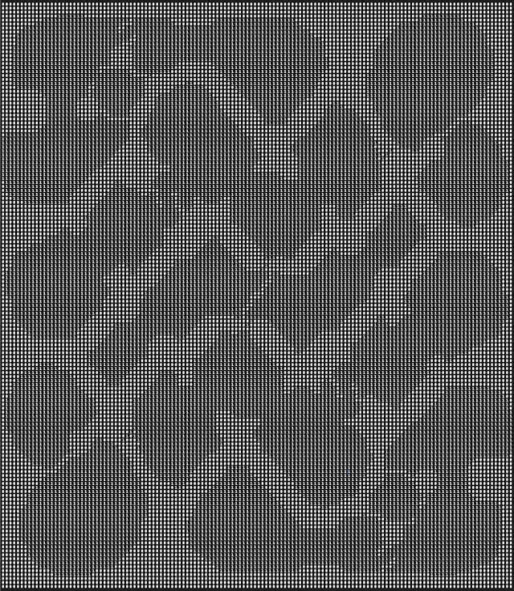
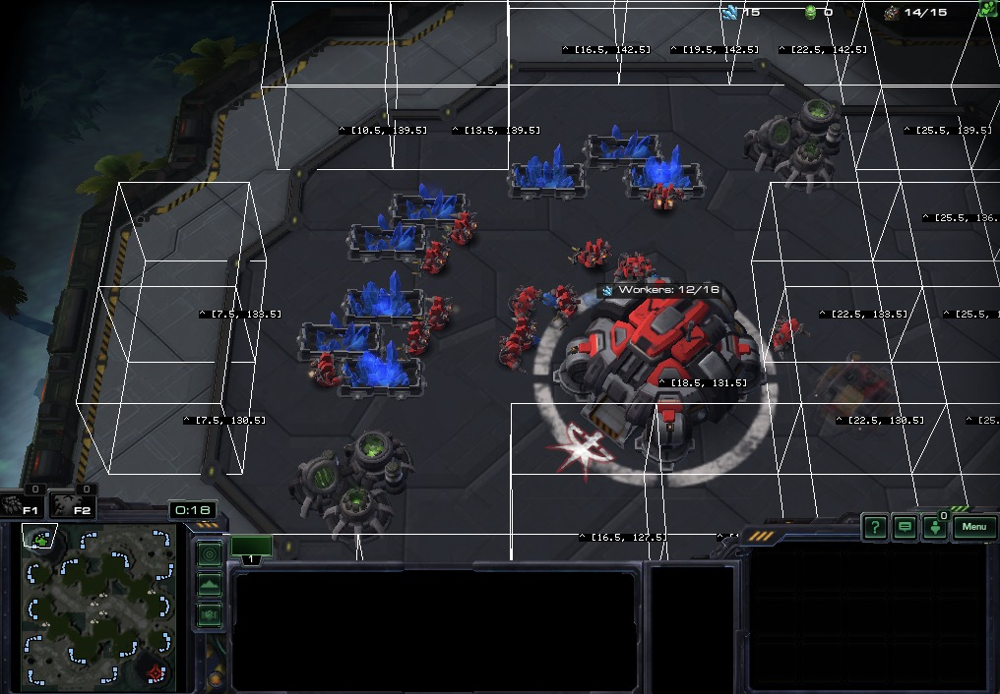

# TUTORIAL 3

# Terran
## Structures

Moving ahead without Terran build, it's time to add structures.  
We already know that we wish to build a supply depot (`Api::UnitTypeId::SUPPLYDEPOT`), but where do we want to build it?  

### Visualizing the placement grid
We'll discuss maps in detail later, but you can picture the world as a minimap represented in a grid of `1`'s and `0`'s    
Here is an example of `geo.placement_grid` for "SiteDelta512AIE" printed out as `1` and `0` for placeable or not.



For map and geometry helpers, your Bot can always look to `#geo` which returns an instance of {Sc2::Player::Geometry}. 

### Find placement coordinates

Buildable locations are internally detected using `geo.build_coordinates`.
This method makes sure the requested surface area is placeable and not obstructed by other buildings.
It returns the center point of each detected block.

Lets find all placement blocks with a length of 3x3 and draw some boxes to mark them with a debug command.    
We will work in blocks of 3x3 even though the supply depot size is 2x2, to allow room for units to move around it and not wall ourselves in.

```ruby
# Print label for Command Centre position
debug_text_world("^ [#{base.pos.x}, #{base.pos.y}]", point: base.pos)

# Debug all the points for length 3x3 which are buildable 
geo.build_coordinates(length: 3).each do |x, y|
  # To draw in 3d we need a Z-axis, so use the ground height at this point
  z = geo.terrain_height(x: x, y: y)
  build_point = Api::Point[x, y, z]
  
  debug_draw_box(point: build_point, radius: 1.5) # Draw box
  debug_text_world("^ [#{x}, #{y}]", point: build_point) # Draw label
end

```
If you run the code above, you'll notice the white boxes drawn around each point in the game. We also have labels where the `^` roughly point to the coordinates it represents.



### Select a placement nearby a target

How we pick one of these placement blocks is now our own choice. 
The **most common** method is selecting one near a specific position or building.  
For thís method we have `geo.build_placement_near` (which uses `geo.build_coordinates` internally), but also takes a **target** location.  
This allows us to essentially ask the library, "Give me a build location, spaced L units apart, nearest to a position/building.".

**Get to work!**  
If we have a location, all we have to do is perform the `build` action on our worker with the desired unit type and target, like this:  
`worker_unit.build(unit_type_id: ..., target: ...)`

The full example using `geo.build_placement_near` with a `target` of our main base, looks as follows:
```ruby
def on_step
  # ...

  # If we've used up 75% of our supply and can afford a depot, lets build one
  space_is_low = common.food_used.to_f / common.food_cap.to_f > 0.75
  
  # Hard supply max: 200. Adding more supply buildings this doesn't grow the cap.
  supply_can_grow = common.food_cap < 200
  
  if space_is_low && supply_can_grow && can_afford?(unit_type_id: Api::UnitTypeId::SUPPLYDEPOT)

    # Pick a random worker
    builder = units.workers.random
    
    # Get location near base 3-spaced for out 2x2 structure to prevent blocking ourselves in.
    build_location = geo.build_placement_near(length: 3, target: base)
    
    # Tell worker to build at location
    builder.build(unit_type_id: Api::UnitTypeId::SUPPLYDEPOT, target: build_location)
  end
end
```

Success! We add supply and can theoretically max out all the way to the 200 hard limit.  
The method `geo.build_placement_near` also ensures that the tiles are powered for Protoss and on creep for Zerg. Nifty.  

In a perfect world, we're set, but things aren't always perfect...

### Robustness in Randomness

If a unit is blocking your placement choice or your builder can't reach that point, you will end in a dead-loop.
You might not be able to immediately resolve the issue, but we can be a bit more tolerant by varying our build locations.

By default, `build_placement_near` returns the point nearest to the requested `target:`, but `build_placement_near` also has an optional `random:` parameter.  
What this `random:` does, is fetch the nearest N placements and then randomly selects one of them.
```ruby 
build_location = geo.build_placement_near(length: 3, target: base, random: 3)
``` 
The above example chooses a build location from the 3 nearest suitable placement blocks near your main base.   
If one of them is blocked, you can potentially unblock yourself on the next attempt.   

A bit of randomness can help your bot recover from unexpected situations. A good `random:` sampling without much performance cost is 3-5.  

---

<div class="docstring"><div class="note">
It might be helpful for you to run this example and see it's output: <a href="https://github.com/dysonreturns/sc2ai/blob/main/docs/examples/03_terran_building.rb">03_terran_building.rb</a>  
</div></div>

But wait... our builders are standing idle after building depots. 
Let's learn to queue actions, so we can send them back to work once they are done.

---


{file:docs/TUTORIAL_04.md Next ➡️}


