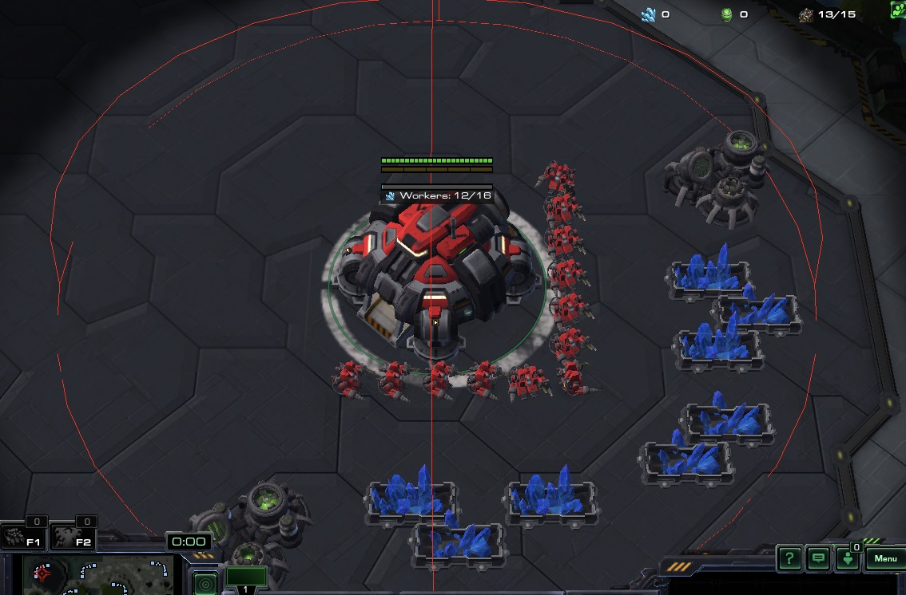

# TUTORIAL 5

# Terran

<div class="docstring"><div class="note">
<strong>Glossary</strong><br/>
Vespene Gas: Colloquially "Gas". The green resource required for advanced upgrades/structures/units. <br/>
<code>`common.vespene` #=> Integer units of vespene gas in your bank</code><br/><br/>
Geyser: A bare vespene resource on the map. Requires a gas extraction structure to be harvested. <br/>
<code>`neutral.geysers` #=> Unit Group of type geyser</code><br/><br/>
Gas or Gasses: Referring to a gas extraction structures. "Has taken two gasses", "Gas-less expand". <br/>
<code>`structures.gas` #=> Unit Group of type Refinery/Extractor/Assimilator</code><br/>
</div></div>

## Geysers, Gas and Gathering Vespene 

The plan is simple: Build gas structures on-top of geysers and send in harvesters.

### Get the geysers

At this point we are well armed to find geysers nearby our main base, right?
```ruby
geysers_for_main = main_base.nearest(units: neutral.geysers, amount: 2)
```
It would be tempting to run this code universally, but other expansions on the map might not have exactly two geysers.  
We might donate free SCV's to the enemy if we pick the wrong build location. Not ideal.  

#### Select Units inside a circle

Since we don't know how many geysers belong to this base, our first instinct could be drawing a circle around the main base, the selecting only the geysers inside of it.



Fiddling with the auto-complete on `neutral.geysers`, we spot a Unit Group filter {Sc2::UnitGroup#select_in_circle UnitGroup#select_in_circle} which takes a `point` and a `radius`.

```ruby
geysers_for_main = neutral.geysers.select_in_circle(point: main_base.pos, radius: 8.5)

# Works for minerals
minerals_for_main = neutral.minerals.select_in_circle(point: main_base.pos, radius: 8.5)

# Works for gas structures too
gas_for_main = structures.gas.select_in_circle(point: main_base.pos, radius: 8.5)
```
This check's each geyser's distance to the main base's position and ensures it's less than 8.5 units away.  
Perfectly valid, but this method does unnecessary calculation, since it needs to do distance checks for every mineral/geyser/gas on the map.  

`select_in_circle` is an excellent method and quite fast, but let's save whatever computation time we can for battle.   

#### Geo located resources

More efficient and exact are the purpose-built methods in `geo`.

```ruby
geysers_for_main  = geo.geysers_for_base(main_base)
minerals_for_main = geo.minerals_for_base(main_base)
gas_for_main      = geo.gas_for_base(main_base)
```
These are fast, because we do static map analysis once when the game starts and then use these values when doing lookups.  
Tidy too. The best option.

### Gas structures

Time to plant a gas structure on-top of the geyser. For Terran this structure is called a Refinery.

```ruby
def on_step
  # ...
  
  # Get geysers for main
  geysers_for_main = geo.geysers_for_base(main_base)

  # For each of them...
  geysers_for_main.each do |geyser|
    # ensure we can afford a refinery or break the loop
    break unless can_afford?(unit_type_id: Api::UnitTypeId::REFINERY)
    
    # and build a refinery on-top of the geyser position
    units.workers.random.build(unit_type_id: Api::UnitTypeId::REFINERY, target: geyser)
  end

end
```
With that, our gasses build organically as soon as we can afford them.  

<div class="docstring"><div class="note">
Note: Depending on your planned build order, you might want to delay the gas by waiting for `common.food_used` to be greater than a specific amount or only build <em>one</em> refinery at first.
</div></div>


### Harvesting

Right now, as refineries finish, only the constructing worker will harvest gas automatically.   
On-top of the refinery we can see that the ideal number of harvesters are 3. It takes 3 workers to "saturate" the gas optimally.  

It's also worth considering that gas harvesters could drop for various reasons, i.e. workers destroyed by the enemy.  
Therefore, it's worth keeping a continuous eye on our refineries to ensure that they are saturated.

After our construction code, we add:
```ruby
# Gas saturation checks @ every 2s
if game_loop % 32 == 0 
  
  # Get all gas structures for main base
  gasses = geo.gas_for_base(main_base)

  # Loop over completed gasses (don't worry about those under construction)
  gasses.each do |gas|
    # Skip buildings which are still in progress
    next unless gas.is_completed?
      
    # Move on to the next gas if we are not missing harvesters
    next if gas.missing_harvesters.zero?

    # From the 5 nearest workers, randomly select the amount needed and send them to gas
    gas.nearest(units: units.workers, amount: 5)
      .random(gas.missing_harvesters)
      .each { |worker| worker.smart(target: gas) }
  end
end
```

Now, when we execute our bot, the green starts pouring in. Let's review.

#### Prioritize tasks
All code we execute comes at a performance cost.  
It would be convenient to check everything on every frame, but we must always be mindful of priority.

This next condition limits how frequently refinery saturation is checked. Instead of every frame, let's do once every 2 in-game seconds.  
`1 in-game second  = 16 frames`      
`2 in-game seconds = 32 frames`, so check that `game_loop` is divisible by `32`.

```ruby
if game_loop % 32 == 0
  #...
end
```

It works for us, because our `@step_count` is `2` (we step forward two frames at a time), so we run on all even numbers for `game_loop`.

The danger though, is that the steps we take might sometimes be variable.  
In realtime mode (Bot vs Human), **steps counts change unpredictably**.  

To have finer control and also to be less rigid, we should rather implement a time-difference method.

Here is an approach which remembers- and compares how many frames have passed since the last saturation check:
```ruby
# Save the game_loop on which we last checked (initially zero)
@last_saturation_check ||= 0

# If 32 frames have passed since our last check
if game_loop - @last_saturation_check >= 32
  
  # Perform logic...
  
  # Update last checked time
  @last_saturation_check = game_loop
end
```

That's two more lines of code, but our bot is more flexible.   
`32` frames can be 31, 33, anything and our step count can be variable.
This code is safe for realtime mode. 


#### Unit construction progress  

During our checks, we don't send workers to harvest until a refinery has finished building.

```ruby
gasses.each do |gas|
  # Skip buildings which are still in progress
  next unless gas.is_completed?
  
  #...
end
```

Each Unit has a property called `build_progress`, which stores a value between `0.0` and `1.0`.  
The helper method `unit.is_completed?` returns `true` if a Unit is completed, meaning `build_progress == 1.0`.  

```ruby
# This accomplishes the same as above:
gasses.each do |gas|
  next if gas.build_progress < 1.0
  #...
end

# As does this variation. An upfront filter using UnitGroup#select and symbol-to-proc shorthand:
gasses.select(&:is_completed?).each do |gas|
  #...
end
```

#### Harvester methods

Both base structures (`structures.hq` Command Centre/Nexus/Hatch) and gas structures (`structures.gas` Refinery/Extractor/Assimilator) have a set of harvester methods.  
For saturation, we typically check `missing_harvesters`, which is `ideal_harvesters` minus `assigned_harvesters`.

Let's examine an imaginary gas with one miner assigned.
```ruby
gas_structure = structures.gas.random
puts gas_structure.ideal_harvesters #=> 3
puts gas_structure.assigned_harvesters #=> 1
puts gas_structure.missing_harvesters #=> 2
```

And now our code should make more sense:

```ruby
gasses.each do |gas|
  #...
  
  # Move on to the next gas if we are not missing harvesters
  next if gas.missing_harvesters.zero?

  # From the 5 nearest workers, randomly select the amount needed
  gas.nearest(units: units.workers, amount: 5)
     .random(gas.missing_harvesters)
  #...
  
end
```
The number 5 here is arbitrarily chosen as anything higher than 3, to give us some flexibility in random selection.  
The end result is this: In our case, we have 2 missing harvesters, so we would randomly select 2 out of the 5 nearest workers for harvesting.  

#### Harvest vespene

And finally, we loop over each selected worker and use the `SMART` ability on the target gas structure.  
This will trigger the `HARVEST_GATHER` ability in the background, just as a right-click would, but the "smart" syntax has the benefit of being brief.

```ruby
gas.nearest(units: units.workers, amount: 5)
   .random(gas.missing_harvesters)
   .each { |worker| worker.smart(target: gas) }
```

---

Now we're cooking with gas. Download and run the full example and see it in action:
[05_terran_gas.rb](https://github.com/dysonreturns/sc2ai/blob/main/docs/examples/05_terran_gas.rb)

So we have one base up and running, but we're clearly over-saturating on workers per mineral patch. We need more bases.  
Are you thinking what I'm thinking? Time to take over the map!

---

{file:docs/TUTORIAL_06.md Next ➡️}
