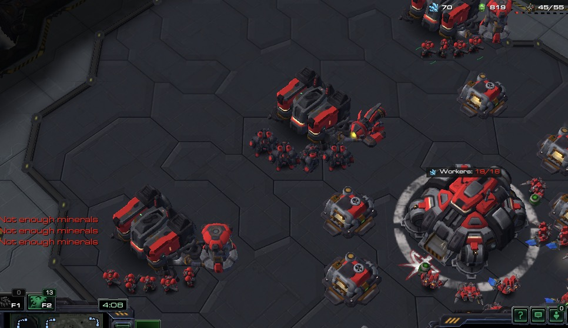

# TUTORIAL 6

# Terran

⚠️ If you know the game well, you can skip the primer and the math and get straight to [building barracks](#label-Building+Barracks).  
It is important to be methodical as we are still building a system, even if inside a game engine. Tiny lives are at stake! :P    
The equations below is to help (re)introduce you to theory crafting. First and last time, promise.  

<hr />
<div class="docstring">
<div class="note">
<strong>Military primer</strong><br/>

<br/>


The Terran production is standard RTS format:<br/>
You queue a unit at a production facility at a cost. One unit from the queue is trained at a time. A new unit appears when completed.<br/>
Optimally, unit production is <strong> constant</strong> - providing consistent growth.<br/>
<br/>
Three production buildings distinctly produce: 💪Biological, 🦾Mechanical and 🚀Air units.<br/>
<br/>
Each building can choose on of two <strong> add-on</strong> structures, which either<br/>
- allows two units to be built at once (<strong> Reactor</strong> 2️⃣) or<br/>
- provides additional tech (<strong> Tech Lab</strong> 🧪).<br/>
These are mini-structures which attach on the side of the main building.<br/>
  <br/>
A <strong>Command Centre</strong> may be upgraded converted into a defensive structure with ground attack. A <strong> Bunker</strong> structure can load biological units while offering additional safety. A Turret is an anti-air defense structure.<br/>
  <br/>
The army can utilize two regenerative mechanics:<br/>
- <strong> Repair</strong> (mechanical) via SCV workers and<br/>
- <strong> Heal</strong> (biological) via flying Medivac army units.<br/>


</div>
</div>

## Army Production

### What is our goal?

To start simple, will only build Biological units.   
We will construct Barracks to produce Marines as our main army.  

We happen to know that adding a Tech Lab add-on provides upgrades for our Marines, so we will add one of those.  
We also know that a Reactor allows Barracks to double it's output, so let's use that too.

When adding a Tech Lab to a Barrack, we get access to a heavier unit, the Marauder, so from that one Barrack we will build this unit.  
For the rest of the Barracks, we want Reactors to produce Marines two at a time.

```
1 x Barracks + Tech Lab 
N x Barracks + Reactor
```
How many is N and what can we afford?

### How many Barracks

Let's work out minerals per minute for income vs production and solve.  
We ignore gas requirements to keep things simple, but in many cases you rather want to consider gas as the restriction.  

```ruby

<<~NAPKIN_MATHEMATICS

    1x Base without tricks gives roughly 925 Minerals per minute (googled) 
    Marauder costs 100M and builds in 21s (googled) 
    Marine costs 50M and builds in 18s (googled)
    
    Now normalize everything to Minerals per minute:
    100M / 21s * 60s = 285.714285714285714 Mpm Marauder cost  
    50M / 18s * 60s = 166.666666666666667 Mpm Marine cost  
    
    Subtract our constant Marauder production cost from total income to see remaining income
    925 - 285.714285714285714 = 639.2857142857143 Mpm income

    Then divide our Marine cost per minute into that to see how many Marines per minute we can build  
    639.2857142857143 / 166.666666666666667 =  3.835714285714285 Marines per minute  
    
    Therefore our base needs 3x Barracks:  
    1x Barrack with a Tech Lab (builds one Marauder at a time)  
    2x Barracks with Reactors (builds 2 Marines at a time) = 4 marines per minute
  
NAPKIN_MATHEMATICS
```
This kind of exercise you can do any time. It is within your power and to your own benefit.  
You'll learn most unit costs and stats by heart over time.  
  

### Building Barracks 

```ruby
def on_step
  # ...

  # Build barracks once we have a completed depot, up to a max of 3 per base
  barracks = structures.select_type(Api::UnitTypeId::BARRACKS)
  depots = structures.select_type(Api::UnitTypeId::SUPPLYDEPOT).select(&:is_completed?)

  if depots.size > 0 && barracks.size < 3
    (3 - barracks.size).times do
      
      # ensure we can afford it
      break unless can_afford?(unit_type_id: Api::UnitTypeId::BARRACKS)

      builder = units.workers.random

      # Use 6-spaced build blocks for a 3x3 structure + a 2x2 add-on + 1 open square for walking 
      # 3 + 2 + 1 = 6
      build_location = geo.build_placement_near(length: 6, target: main_base, random: 3)
      builder.build(unit_type_id: Api::UnitTypeId::BARRACKS, target: build_location)
      builder.smart(target: geo.minerals_for_base(main_base).random, queue_command: true)
    end
  end

end
```

There are no new API concepts here.  

```ruby
  barracks = structures.select_type(Api::UnitTypeId::BARRACKS)
  depots = structures.select_type(Api::UnitTypeId::SUPPLYDEPOT).select(&:is_completed?)
```
We select our barracks (initially zero) and _completed_ supply depots.    
There are many ways to check completion, but use {Api::Unit#is_completed? Unit#is_completed?} in a short-hand `select` for it's brevity.  
Any boolean from Unit that doesn't need parameters can be used in this short form (`is_flying?`, `is_mechanical?`, etc.).  

```ruby
# If missing anything...
if depots.size > 0 && barracks.size < 3
  
    # That many times...
    (3 - barracks.size).times do
      
      break unless can_afford?(unit_type_id: Api::UnitTypeId::BARRACKS)
      # Build ...
    end
  
end
```

3 minus our barrack count will tell us how many are missing.  
For however many are missing, start construction if we can afford it.  

Building is a familiar sequence of code:
```ruby
builder = units.workers.random

# Use 6-spaced build blocks for a 3x3 structure + a 2x2 add-on + 1 open square for walking 
# 3 + 2 + 1 = 6
build_location = geo.build_placement_near(length: 6, target: main_base, random: 3)
builder.build(unit_type_id: Api::UnitTypeId::BARRACKS, target: build_location)
builder.smart(target: geo.minerals_for_base(main_base).random, queue_command: true)

```
  
Send a random worker to build on a 6x6 spaced grid near the main base and then continue mining. 

### 7x7 sim cities 

Barracks are `3x3`, so you'd think it'd need a `4`-spaced building point to allow `1` space for units to walk around (`3+1`).  
The add-on adds `2x2` to it's shape, though, effectively making it's size `5x5`.

Therefore,  
💪Barracks are best spaced `6` squares.   
🦾Factories which produce massive mechanical units might need `7`.  
🚀Starports which doesn't really need walking space for it's own units can take up 5 or `6` spaces.  

The Problem is packing your Barracks too tightly might limit the movement of your Factory units later!

**Universally using 7-spaced grid** for all army building placements takes away all worries of trapping units, but you can run out of space in your main base faster than usual.

### Add-on

Back to the Barracks, lets build those extensions we planned around: 
```ruby

# Build add-ons to completed barracks
barracks = barracks.select(&:is_completed?) # only focussing on completed barracks...

# If we can't find a barracks with a tech lab
if barracks.size > 0 && !barracks.find(&:has_tech_lab?)
  # Build a tech lab
  barracks.random.build_tech_lab if can_afford?(unit_type_id: Api::UnitTypeId::BARRACKSTECHLAB)
else
  # We have at least one tech lab already, for the rest we add reactors

  # Select without add_on == Reject where add_on present
  barracks.reject(&:add_on).each do |barrack|
    break unless can_afford?(unit_type_id: Api::UnitTypeId::REACTOR)

    # Build a reactor
    barrack.build_reactor
  end
end

```

We filter our group of barracks to hold only completed structures for this exercise.  
Then, start off by building the Tech Lab first, which means we simply add reactors to everything which follows.

```ruby
if barracks.size > 0 && !barracks.find(&:has_tech_lab?)
  # Build a tech lab
  barracks.random.build_tech_lab if can_afford?(unit_type_id: Api::UnitTypeId::BARRACKSTECHLAB)
else
  # reactors..,.
end
```
#### find a unit

We have done a lot of filters with `select`, which narrows down a group of units, but how about finding a single specific unit?   
The unit group `find` method returns the first Unit for which the block returns a truthy value (or `nil` if not found).

```ruby
barrack_with_tech_lab = barracks.find(&:has_tech_lab?) #=> the first barrack where has_tech_lab? is true

# Block syntax for more complex find
barrack_with_idle_tech_lab = barracks.find do |barrack|
  barrack.has_tech_lab? && !barrack.is_active?
end  #=> the first barrack which has an idle tech lab
```

#### build_tech_lab / build_reactor
The `#build_tech_lab` ability is simply a helper which executes `#build` with the correctly detected type, i.e. `Api::UnitTypeId::BARRACKSTECHLAB`.  

Reactors have a similar method in `#build_reactor`.
```ruby
# else...

  barracks.reject(&:add_on).each do |barrack|
    break unless can_afford?(unit_type_id: Api::UnitTypeId::REACTOR)
    
    barrack.build_reactor
  end
```
Both of these supports any type of building (Barracks/Factories/Starports).

#### add_on
On a production building, you can call `#add_on`, which returns the Unit if present or `nil` if there is no add-on.  
This access will be useful later as our Tech Lab has some research buttons we wish to press!  

We use the fact that it returns `nil` with the `reject` filter, to get only barracks which don't have add-ons.  
If you find it clearer, you can remove the short-hand and filter inside such a loop instead: 
```ruby
barracks.each do |barrack|
  next unless barrack.add_on.nil?

  # ... build a add-on
end
```

### Train an army

All according to plan.

```ruby

barracks.each do |barrack|
  # Ensure we have an add-on and that it's completed
  next unless barrack.add_on && barrack.add_on.is_completed?

  # If we have a tech lab, build 1x MARAUDER, if a reactor, then 2x MARINES
  if barrack.has_tech_lab?
    unit_type_to_train = Api::UnitTypeId::MARAUDER
    quantity = 1
  else
    unit_type_to_train = Api::UnitTypeId::MARINE
    quantity = 2
  end

  # If our orders are empty or near completion...
  if barrack.orders.size == 0 || barrack.orders.size <= 2 && barrack.orders.any? { |order| order.progress > 0.9 }
    # Send the train command quantity times.
    quantity.times do
      # Note queue_command is true for the reactor, because multiple actions on the same frame overwrite each other.
      barrack.train(unit_type_id: unit_type_to_train, queue_command: true)
    end
  end
end
```


Remember that `barracks` are all the completed barracks.  
We additionally make sure that we have add-ons and that they are completed.

As from our goals, the Tech Lab barrack builds the heavier Marauder unit (one at a time) and the Reactor barracks build marines (two at a time).

- We set these in `quantity` and `unit_type_to_train` and then do our usual production limit checks.
- If the barrack has no orders or has two or less which are nearly done, then...  
- For `quanity` amount of times...  
- Queue a train command for the unit type id, `unit_type_to_train`.  




And there they are! We did it, we came up with a plan and executed on it!

The full example is here if you'd like to run it exactly:  
[06_terran_army.rb](https://github.com/dysonreturns/sc2ai/blob/main/docs/examples/06_terran_army.rb)

---

They do look a bit awkward standing next to the barracks like that.  
Next, let's rally these troops to a defensive position.   
Then, once we reach critical mass, we'll send them out to attack!

---

{file:docs/TUTORIAL_07.md Next ➡️}

